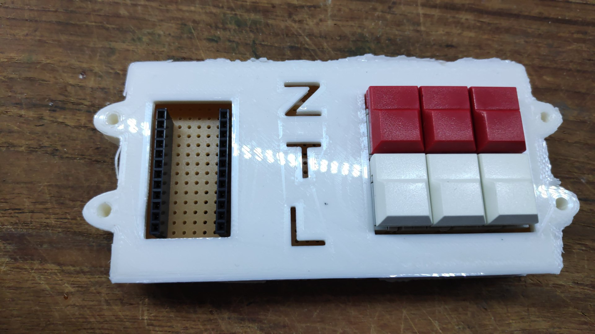

# Zusammenbau der Hardware

Gehäuse Boden.

Platine einlegen. (Glatte Kante vorn) Wenns nicht passt. Passend machen.

Gehäuse Deckel auflegen.

Taster positionieren.

Gehäuse Deckel wieder herunternehmen.

Lochrasterplatine mit Tastern aus dem Gehäuseboden rausnehmen. (Evtl. mit Schraubenzieher)

Vorsichtig umdrehen.

Taster festlöten.

Stiftleisten an den Arduino löten. (kein Bild vorhanden - das schafft Ihr aber) ;)

Buchsenleisten platzieren (So wie bei den Tastern vorgehen)

Arduino einstecken, damit es nicht krumm wird.

Buchsenleisten anlöten.

Verbindungen Löten.

Lötplan:

Boden und Deckel verschrauben.
Vermutlich ist ein bisschen Gewalt bzw. Aufbohren notwendig.

